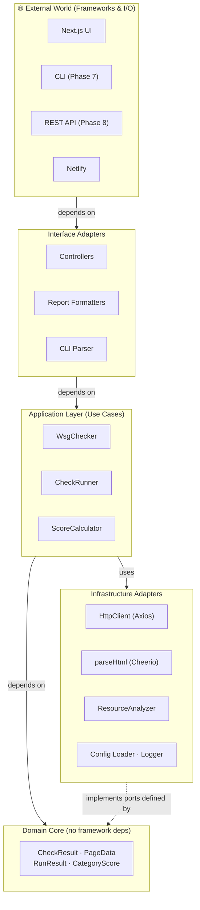
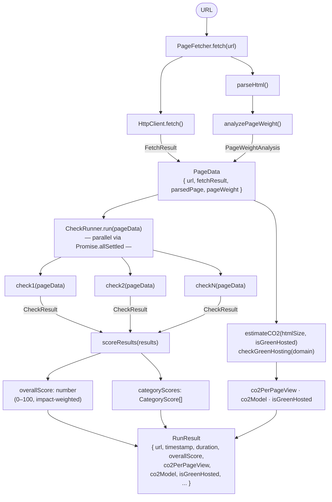

# WSG-Check

A Web Sustainability Guidelines checker for websites. It checks a website against the Web Sustainability Guidelines and provides a report on the sustainability of the website.

## Architecture

WSG-Check uses a **Hexagonal Architecture** (Ports and Adapters) layered over a **Clean Architecture** dependency rule: the domain core has zero knowledge of frameworks, databases, or external services. All I/O is pushed to the outermost layer and accessed only through well-defined interfaces.



### Dependency Rule

All source-code dependencies point **inward**:

- `core/` may import from `utils/` and `config/` — never from `app/` or `cli/`.
- `checks/` may import from `core/` and `utils/` — never from `report/` or `cli/`.
- `report/` may import from `core/` — never from `cli/` or `app/`.
- `app/` and `cli/` are the outermost adapters; they may import from any inner layer.

### Ports and Adapters

| Port (interface)      | Adapter (implementation)                            |
| --------------------- | --------------------------------------------------- |
| HTTP fetch            | `HttpClient` via Axios                              |
| HTML parsing          | `parseHtml` via Cheerio                             |
| Resource analysis     | `analyzePageWeight`                                 |
| Carbon estimation     | `estimateCO2` / `checkGreenHosting` via `@tgwf/co2` |
| Configuration loading | `resolveConfig` (file + env + CLI)                  |
| Logging               | `createLogger` (terminal or JSON)                   |
| Check execution       | `CheckRunner.run` (parallel execution)              |
| Scoring               | `scoreResults`                                      |
| Report formatting     | (Phase 6) JSON / Markdown / HTML / CLI              |

### Data Flow Pipeline



### Module Overview

| Module       | Path          | Responsibility                                           |
| ------------ | ------------- | -------------------------------------------------------- |
| **Core**     | `src/core/`   | Orchestration: fetch → parse → check → score             |
| **Checks**   | `src/checks/` | Individual WSG guideline checks (Phases 4–5)             |
| **Report**   | `src/report/` | Format `RunResult` as JSON / Markdown / HTML / Terminal  |
| **CLI**      | `src/cli/`    | Command-line interface (Phase 7)                         |
| **API**      | `src/api/`    | REST endpoints (Phase 8)                                 |
| **Utils**    | `src/utils/`  | Shared infrastructure: HTTP, HTML parser, logger, errors |
| **Config**   | `src/config/` | Configuration schema, defaults, env/file loading         |
| **Frontend** | `src/app/`    | Next.js App Router pages and UI components (Phase 9)     |

### Core Module (`src/core/`)

The Core Module is the application-layer heart introduced in **Phase 3**. It contains no framework-specific code; it depends only on `utils/` and `config/`.

#### `types.ts` — Shared Domain Types

```typescript
interface CheckResult {
  guidelineId: string // e.g. "3.2"
  status: 'pass' | 'fail' | 'warn' | 'info' | 'not-applicable'
  score: number // 0–100
  impact: 'high' | 'medium' | 'low'
  category: WSGCategory
  // …
}

type CheckFn = (page: PageData) => CheckResult | Promise<CheckResult>

interface PageData {
  url: string
  fetchResult: FetchResult
  parsedPage: ParsedPage
  pageWeight: PageWeightAnalysis
}

interface RunResult {
  url: string
  timestamp: string
  duration: number
  overallScore: number
  categoryScores: CategoryScore[]
  results: CheckResult[]
  co2PerPageView: number // grams of CO2 per page view (SWD v4 model)
  co2Model: 'swd-v4'
  isGreenHosted: boolean // from Green Web Foundation API
}
```

#### `fetcher.ts` — `PageFetcher`

Wraps `HttpClient` and `parseHtml` to produce a complete `PageData` bundle. Returns a `Result<PageData>` discriminated union — **never throws**.

#### `runner.ts` — `CheckRunner`

Accepts registered `CheckFn` implementations and executes them in parallel using `Promise.allSettled`. Synchronous check errors are transparently converted to rejection-based `'fail'` results, enabling graceful degradation.

#### `scorer.ts` — Score Calculator

Pure functions that derive weighted sustainability scores:

| Score type       | Formula                                                    |
| ---------------- | ---------------------------------------------------------- |
| Per check        | `pass → 100`, `warn → 50`, `fail → 0`                      |
| Impact weighting | `high × 3`, `medium × 2`, `low × 1`                        |
| Category score   | `Σ(points × weight) / Σ(weight)` for all scoreable results |
| Overall score    | Same formula across all categories combined                |

#### `index.ts` — `WsgChecker`

The top-level orchestrator. Wires `PageFetcher`, `CheckRunner`, and `scoreResults` into a single `check(url)` method that returns `Result<RunResult>`.

```typescript
const checker = new WsgChecker({ timeout: 15_000 }, [myCheck1, myCheck2])
const result = await checker.check('https://example.com')
if (result.ok) console.log('Score:', result.value.overallScore)
```

## Utils Module

Located in `src/utils/`, this module provides the shared building blocks consumed by the Core, Checks, and CLI modules.

### `http-client.ts` — HTTP Client

A configurable, sustainability-aware HTTP client built on [Axios](https://axios-http.com/).

**Features:**

- **In-memory caching** — duplicate fetches for the same URL within a session are served from cache.
- **Retry with back-off** — transient network errors are retried up to `maxRetries` times with an exponential delay.
- **robots.txt support (WSG 4.6)** — fetches and caches the target site's `robots.txt` before making requests; raises `FetchError` if the crawler is disallowed.
- **Redirect chain tracking (WSG 4.4)** — follows redirects manually so every hop is recorded in `FetchResult.redirectChain`.

```typescript
import { HttpClient } from '@/utils'

const client = new HttpClient({ timeout: 15_000, userAgent: 'my-bot/1.0' })
const result = await client.fetch('https://example.com')
// result.redirectChain, result.headers, result.body …
```

### `html-parser.ts` — HTML Parser

Parses raw HTML into a structured `ParsedPage` object using [Cheerio](https://cheerio.js.org/).

**Extracts:**

- Document metadata: `<title>`, `lang`, `<meta>` tags, `<link>` elements
- Resource references: stylesheets, scripts, images (including `srcset`), fonts (preloads), media
- Semantic structure: heading hierarchy, landmark elements, ARIA attributes
- Accessibility signals: skip-navigation links
- Structured data: JSON-LD blocks

```typescript
import { parseHtml } from '@/utils'

const page = parseHtml(htmlString, 'https://example.com')
// page.title, page.resources, page.headings, page.landmarks …
```

### `resource-analyzer.ts` — Resource Analyzer

Aggregates resource data into sustainability metrics.

**Provides:**

- `classifyResources()` — labels each resource as first-party or third-party.
- `analyzeCompression()` — detects gzip / brotli / zstd from response headers.
- `analyzePageWeight()` — returns `htmlSize`, `resourceCount`, first/third-party split, compression info, and per-type counts.

### `carbon-estimator.ts` — Carbon Estimator

Estimates CO2 emissions per page view using the [CO2.js](https://www.thegreenwebfoundation.org/co2-js/) library (Sustainable Web Design v4 model) and checks whether a domain is served from renewable energy via the [Green Web Foundation API](https://www.thegreenwebfoundation.org/tools/green-web-dataset/).

**Provides:**

- `estimateCO2(bytes, isGreenHosted)` — pure function; returns grams of CO2 rounded to 4 decimal places.
- `checkGreenHosting(domain)` — async; queries the Green Web Foundation API and returns `boolean`. Falls back to `false` on network errors so the pipeline is never blocked.
- `CO2_MODEL` — string constant `'swd-v4'` exposed as the `co2Model` field in `RunResult`.

```typescript
import { estimateCO2, checkGreenHosting, CO2_MODEL } from '@/utils'

const isGreen = await checkGreenHosting('example.com')
const grams = estimateCO2(pageWeight.htmlSize, isGreen)
// grams: e.g. 0.0012 (rounded to 4 d.p.)
// CO2_MODEL: 'swd-v4'
```

### `errors.ts` — Custom Error Classes

| Class         | Purpose                                                                 |
| ------------- | ----------------------------------------------------------------------- |
| `FetchError`  | Network or HTTP-level failures; carries the offending `url`.            |
| `ParseError`  | HTML or document parsing failures.                                      |
| `ConfigError` | Invalid or incomplete configuration; optionally carries a `field` name. |
| `CheckError`  | Individual check runtime failures; carries the `guidelineId`.           |

All classes extend `Error` and preserve the `cause` chain where applicable, enabling graceful degradation: a `CheckError` from one check is caught by the runner and recorded without aborting the remaining checks.

### `logger.ts` — Logger

A lightweight structured logger supporting two output modes:

| Mode                 | Output                                           | Suitable for          |
| -------------------- | ------------------------------------------------ | --------------------- |
| `terminal` (default) | `[INFO] message`                                 | CLI                   |
| `structured`         | `{"level":"info","message":"…","timestamp":"…"}` | API / log aggregators |

```typescript
import { createLogger } from '@/utils'

const log = createLogger({ level: 'debug', structured: false })
log.info('Fetching URL', { url: 'https://example.com' })
```

## Checks Module (`src/checks/`)

The Checks Module contains the individual WSG guideline check functions introduced in **Phase 4**. Each check is a pure `CheckFn` — a function that accepts the pre-assembled `PageData` bundle and returns a `CheckResult`. Checks depend only on `core/types.ts` (the domain layer) and never on frameworks, HTTP clients, or other I/O adapters.

### Phase 4.1 — Performance & Efficiency Checks

| Check                 | File                 | WSG Guideline                             | Impact |
| --------------------- | -------------------- | ----------------------------------------- | ------ |
| `checkMinification`   | `minification.ts`    | 3.3 Minify Your HTML, CSS, and JavaScript | medium |
| `checkRenderBlocking` | `render-blocking.ts` | 3.9 Resolve Render Blocking Content       | high   |

#### `checkMinification` — WSG 3.3

Detects signals of unminified HTML in the served response using two heuristics applied to the raw HTML body:

1. **Blank-line ratio**: if more than 10% of lines are whitespace-only, the HTML is likely not minified.
2. **HTML comment count**: more than 2 non-conditional HTML comments suggest developer source (conditional `<!--[if …]>` comments are excluded).

> **Note:** External CSS and JS file content is not fetched during static analysis, so minification of those assets cannot be verified in this phase.

#### `checkRenderBlocking` — WSG 3.9

Checks for two common sources of render-blocking behaviour:

1. **Scripts without `async` or `defer`** — blocks the HTML parser until the script downloads and executes.
2. **Images without `loading="lazy"`** — forces eager-loading of all images regardless of viewport position.

Scoring:

| Condition                              | Status           | Score |
| -------------------------------------- | ---------------- | ----- |
| Render-blocking scripts present        | `fail`           | 0     |
| Scripts OK, some images lack lazy-load | `warn`           | 50    |
| All scripts deferred, all images lazy  | `pass`           | 100   |
| No scripts or images on the page       | `not-applicable` | —     |

### Using the Checks Module

```typescript
import { WsgChecker } from '@/core'
import { performanceChecks } from '@/checks'

// Register all Phase 4.1 checks at once
const checker = new WsgChecker({ timeout: 15_000 }, performanceChecks)
const result = await checker.check('https://example.com')

// Or register individual checks for more granular control
import { checkMinification, checkRenderBlocking } from '@/checks'

const checker2 = new WsgChecker()
checker2.runner.register(checkMinification)
checker2.runner.register(checkRenderBlocking)
```

## Technologies Used

- **Node.js**: The core runtime environment for the application, allowing us to run JavaScript on the server side.
- **Next.js**: A React framework used for building the frontend of the application, providing server-side rendering and a great developer experience.
- **React v19**: The JavaScript library used for building the user interface of the application.
- **ESLint**: A tool for identifying and fixing problems in JavaScript code, ensuring code quality and consistency across the project.
- **Prettier**: A code formatter that helps maintain a consistent style across the codebase, making it easier to read and maintain.
- **Vitest**: A testing framework used for writing and running tests to ensure the correctness of the application.
- **Axios**: A promise-based HTTP client used for making requests to fetch website content and interact with APIs.
- **Cheerio**: A library for parsing and manipulating HTML content, used for extracting information from the fetched website content.
- **Dotenv**: A module that loads environment variables from a .env file into process.env, allowing for easy configuration of the application.
- **ES Modules**: The module system used for organizing the code into separate files and allowing for better code organization and maintainability.
- **TypeScript**: A typed superset of JavaScript that adds static types to the language, improving code quality and developer experience.
- **Husky**: A tool for managing Git hooks, allowing us to run scripts before commits and pushes to ensure code quality and consistency.
- **Lint-staged**: A tool for running linters on staged Git files, ensuring that only the files that are being committed are checked for code quality issues.
- **ESLint Config Prettier**: A configuration for ESLint that disables rules that conflict with Prettier, allowing for seamless integration between the two tools.
- **PandaCSS**: A utility-first CSS framework used for styling the frontend of the application, providing a flexible and efficient way to create responsive designs.
- **Netlify**: A platform for deploying and hosting the application, providing continuous deployment and a global content delivery network for fast performance.
- **GitHub Actions**: A CI/CD platform used for automating the testing and deployment of the application, ensuring that code changes are properly tested and deployed to production.
- **ArkUI**: A component library used for building the user interface of the application, providing a set of pre-built components that can be easily customized and integrated into the frontend.
- **Park UI**: A component library built on top of Ark UI and PandaCSS, providing beautifully styled, accessible components for the frontend of the application.

## Features

- **Website Analysis**: The core feature of WSG-Check is the ability to analyze a website against the Web Sustainability Guidelines. Users can input a website URL, and the application will fetch the content, run the checks, and generate a report on the sustainability of the website.
- **Detailed Reporting**: The application provides a detailed report that includes the results of each check, along with explanations and recommendations for improving the sustainability of the website. The report is designed to be user-friendly and easy to understand, making it accessible to users with varying levels of technical expertise.
- **Command-Line Interface**: WSG-Check includes a command-line interface that allows users to run checks and generate reports directly from the terminal. This feature is particularly useful for developers and technical users who prefer working in a command-line environment.
