# WSG-Check

A Web Sustainability Guidelines checker for websites. It checks a website against the Web Sustainability Guidelines and provides a report on the sustainability of the website.

## Architecture

WSG-Check uses a **Hexagonal Architecture** (Ports and Adapters) layered over a **Clean Architecture** dependency rule: the domain core has zero knowledge of frameworks, databases, or external services. All I/O is pushed to the outermost layer and accessed only through well-defined interfaces.

```mermaid
graph TB
    subgraph EW["🌐 External World (Frameworks & I/O)"]
        UI["Next.js UI"]
        CLI["CLI (Phase 7)"]
        RESTAPI["REST API (Phase 8)"]
        DEPLOY["Netlify"]
    end

    subgraph IA["Interface Adapters"]
        CTRL["Controllers"]
        FMT["Report Formatters"]
        CLIP["CLI Parser"]
    end

    subgraph AL["Application Layer (Use Cases)"]
        WSG["WsgChecker"]
        CR["CheckRunner"]
        SC["ScoreCalculator"]
    end

    subgraph DC["Domain Core (no framework deps)"]
        TYPES["CheckResult · PageData\nRunResult · CategoryScore"]
    end

    subgraph INF["Infrastructure Adapters"]
        HC["HttpClient (Axios)"]
        HP["parseHtml (Cheerio)"]
        RA["ResourceAnalyzer"]
        CL["Config Loader · Logger"]
    end

    EW -->|depends on| IA
    IA -->|depends on| AL
    AL -->|depends on| DC
    AL -->|uses| INF
    INF -.->|implements ports defined by| DC
```



### Dependency Rule

All source-code dependencies point **inward**:

- `core/` may import from `utils/` and `config/` — never from `app/` or `cli/`.
- `checks/` may import from `core/` and `utils/` — never from `report/` or `cli/`.
- `report/` may import from `core/` — never from `cli/` or `app/`.
- `app/` and `cli/` are the outermost adapters; they may import from any inner layer.

### Ports and Adapters

| Port (interface)      | Adapter (implementation)                                                         |
| --------------------- | -------------------------------------------------------------------------------- |
| HTTP fetch            | `HttpClient` via Axios                                                           |
| HTML parsing          | `parseHtml` via Cheerio                                                          |
| Resource analysis     | `analyzePageWeight`                                                              |
| Carbon estimation     | `estimateCO2` / `checkGreenHosting` via `@tgwf/co2`                              |
| Configuration loading | `resolveConfig` (file + env + CLI)                                               |
| Logging               | `createLogger` (terminal or JSON)                                                |
| Check execution       | `CheckRunner.run` (parallel execution)                                           |
| Scoring               | `scoreResults`                                                                   |
| Report formatting     | `fromRunResult` → `SustainabilityReport` (Phase 6.1 ✅); formatters in Phase 6.2 |

### Data Flow Pipeline

```mermaid
flowchart TD
    URL(["URL"])
    PF["PageFetcher.fetch(url)"]
    HC["HttpClient.fetch()"]
    PH["parseHtml()"]
    APW["analyzePageWeight()"]
    PD["PageData\n{ url, fetchResult, parsedPage, pageWeight }"]
    CR["CheckRunner.run(pageData)\n— parallel via Promise.allSettled —"]
    C1["check1(pageData)"]
    C2["check2(pageData)"]
    CN["checkN(pageData)"]
    SR["scoreResults(results)"]
    OS["overallScore: number\n(0–100, impact-weighted)"]
    CS["categoryScores: CategoryScore[]"]
    CO2["estimateCO2(htmlSize, isGreenHosted)\ncheckGreenHosting(domain)"]
    CO2OUT["co2PerPageView · co2Model · isGreenHosted"]
    RR["RunResult\n{ url, timestamp, duration, overallScore,\n  co2PerPageView, co2Model, isGreenHosted, ... }"]

    URL --> PF
    PF --> HC & PH
    HC -->|FetchResult| PD
    PH --> APW
    APW -->|PageWeightAnalysis| PD
    PD --> CR
    PD --> CO2
    CR --> C1 & C2 & CN
    C1 & C2 & CN -->|CheckResult| SR
    SR --> OS & CS
    CO2 --> CO2OUT
    OS & CS & CO2OUT --> RR
```



### Module Overview

| Module       | Path          | Responsibility                                           |
| ------------ | ------------- | -------------------------------------------------------- |
| **Core**     | `src/core/`   | Orchestration: fetch → parse → check → score             |
| **Checks**   | `src/checks/` | Individual WSG guideline checks (Phases 4–5)             |
| **Report**   | `src/report/` | Format `RunResult` as JSON / Markdown / HTML / Terminal  |
| **CLI**      | `src/cli/`    | Command-line interface (Phase 7)                         |
| **API**      | `src/api/`    | REST endpoints (Phase 8)                                 |
| **Utils**    | `src/utils/`  | Shared infrastructure: HTTP, HTML parser, logger, errors |
| **Config**   | `src/config/` | Configuration schema, defaults, env/file loading         |
| **Frontend** | `src/app/`    | Next.js App Router pages and UI components (Phase 9)     |

### Core Module (`src/core/`)

The Core Module is the application-layer heart introduced in **Phase 3**. It contains no framework-specific code; it depends only on `utils/` and `config/`.

#### `types.ts` — Shared Domain Types

```typescript
interface CheckResult {
  guidelineId: string // e.g. "3.2"
  status: 'pass' | 'fail' | 'warn' | 'info' | 'not-applicable'
  score: number // 0–100
  impact: 'high' | 'medium' | 'low'
  category: WSGCategory
  // …
}

type CheckFn = (page: PageData) => CheckResult | Promise<CheckResult>

interface PageData {
  url: string
  fetchResult: FetchResult
  parsedPage: ParsedPage
  pageWeight: PageWeightAnalysis
}

interface RunResult {
  url: string
  timestamp: string
  duration: number
  overallScore: number
  categoryScores: CategoryScore[]
  results: CheckResult[]
  co2PerPageView: number // grams of CO2 per page view (SWD v4 model)
  co2Model: 'swd-v4'
  isGreenHosted: boolean // from Green Web Foundation API
}
```

#### `fetcher.ts` — `PageFetcher`

Wraps `HttpClient` and `parseHtml` to produce a complete `PageData` bundle. Returns a `Result<PageData>` discriminated union — **never throws**.

#### `runner.ts` — `CheckRunner`

Accepts registered `CheckFn` implementations and executes them in parallel using `Promise.allSettled`. Synchronous check errors are transparently converted to rejection-based `'fail'` results, enabling graceful degradation.

#### `scorer.ts` — Score Calculator

Pure functions that derive weighted sustainability scores:

| Score type       | Formula                                                    |
| ---------------- | ---------------------------------------------------------- |
| Per check        | `pass → 100`, `warn → 50`, `fail → 0`                      |
| Impact weighting | `high × 3`, `medium × 2`, `low × 1`                        |
| Category score   | `Σ(points × weight) / Σ(weight)` for all scoreable results |
| Overall score    | Same formula across all categories combined                |

#### `index.ts` — `WsgChecker`

The top-level orchestrator. Wires `PageFetcher`, `CheckRunner`, and `scoreResults` into a single `check(url)` method that returns `Result<RunResult>`.

```typescript
const checker = new WsgChecker({ timeout: 15_000 }, [myCheck1, myCheck2])
const result = await checker.check('https://example.com')
if (result.ok) console.log('Score:', result.value.overallScore)
```

## Utils Module

Located in `src/utils/`, this module provides the shared building blocks consumed by the Core, Checks, and CLI modules.

### `http-client.ts` — HTTP Client

A configurable, sustainability-aware HTTP client built on [Axios](https://axios-http.com/).

**Features:**

- **In-memory caching** — duplicate fetches for the same URL within a session are served from cache.
- **Retry with back-off** — transient network errors are retried up to `maxRetries` times with an exponential delay.
- **robots.txt support (WSG 4.6)** — fetches and caches the target site's `robots.txt` before making requests; raises `FetchError` if the crawler is disallowed.
- **Redirect chain tracking (WSG 4.4)** — follows redirects manually so every hop is recorded in `FetchResult.redirectChain`.

```typescript
import { HttpClient } from '@/utils'

const client = new HttpClient({ timeout: 15_000, userAgent: 'my-bot/1.0' })
const result = await client.fetch('https://example.com')
// result.redirectChain, result.headers, result.body …
```

### `html-parser.ts` — HTML Parser

Parses raw HTML into a structured `ParsedPage` object using [Cheerio](https://cheerio.js.org/).

**Extracts:**

- Document metadata: `<title>`, `lang`, `<meta>` tags, `<link>` elements
- Resource references: stylesheets, scripts, images (including `srcset`), fonts (preloads), media
- Semantic structure: heading hierarchy, landmark elements, ARIA attributes
- Accessibility signals: skip-navigation links
- Structured data: JSON-LD blocks
- Form inputs: `formInputs` array — each entry captures the input `type`, whether it has a `<label>` (`hasLabel`), and whether it carries an `autocomplete` attribute (`hasAutocomplete`)

```typescript
import { parseHtml } from '@/utils'

const page = parseHtml(htmlString, 'https://example.com')
// page.title, page.resources, page.headings, page.landmarks …
```

### `resource-analyzer.ts` — Resource Analyzer

Aggregates resource data into sustainability metrics.

**Provides:**

- `classifyResources()` — labels each resource as first-party or third-party.
- `analyzeCompression()` — detects gzip / brotli / zstd from response headers.
- `analyzePageWeight()` — returns `htmlSize`, `resourceCount`, first/third-party split, compression info, and per-type counts.

### `carbon-estimator.ts` — Carbon Estimator

Estimates CO2 emissions per page view using the [CO2.js](https://www.thegreenwebfoundation.org/co2-js/) library (Sustainable Web Design v4 model) and checks whether a domain is served from renewable energy via the [Green Web Foundation API](https://www.thegreenwebfoundation.org/tools/green-web-dataset/).

**Provides:**

- `estimateCO2(bytes, isGreenHosted)` — pure function; returns grams of CO2 rounded to 4 decimal places.
- `checkGreenHosting(domain)` — async; queries the Green Web Foundation API and returns `boolean`. Falls back to `false` on network errors so the pipeline is never blocked.
- `CO2_MODEL` — string constant `'swd-v4'` exposed as the `co2Model` field in `RunResult`.

```typescript
import { estimateCO2, checkGreenHosting, CO2_MODEL } from '@/utils'

const isGreen = await checkGreenHosting('example.com')
const grams = estimateCO2(pageWeight.htmlSize, isGreen)
// grams: e.g. 0.0012 (rounded to 4 d.p.)
// CO2_MODEL: 'swd-v4'
```

### `errors.ts` — Custom Error Classes

| Class         | Purpose                                                                 |
| ------------- | ----------------------------------------------------------------------- |
| `FetchError`  | Network or HTTP-level failures; carries the offending `url`.            |
| `ParseError`  | HTML or document parsing failures.                                      |
| `ConfigError` | Invalid or incomplete configuration; optionally carries a `field` name. |
| `CheckError`  | Individual check runtime failures; carries the `guidelineId`.           |

All classes extend `Error` and preserve the `cause` chain where applicable, enabling graceful degradation: a `CheckError` from one check is caught by the runner and recorded without aborting the remaining checks.

### `logger.ts` — Logger

A lightweight structured logger supporting two output modes:

| Mode                 | Output                                           | Suitable for          |
| -------------------- | ------------------------------------------------ | --------------------- |
| `terminal` (default) | `[INFO] message`                                 | CLI                   |
| `structured`         | `{"level":"info","message":"…","timestamp":"…"}` | API / log aggregators |

```typescript
import { createLogger } from '@/utils'

const log = createLogger({ level: 'debug', structured: false })
log.info('Fetching URL', { url: 'https://example.com' })
```

## Checks Module (`src/checks/`)

The Checks Module contains the individual WSG guideline check functions introduced in **Phase 4**. Each check is a pure `CheckFn` — a function that accepts the pre-assembled `PageData` bundle and returns a `CheckResult`. Checks depend only on `core/types.ts` (the domain layer) and never on frameworks, HTTP clients, or other I/O adapters.

### Phase 4.1 — Performance & Efficiency Checks

| Check                 | File                 | WSG Guideline                             | Impact |
| --------------------- | -------------------- | ----------------------------------------- | ------ |
| `checkMinification`   | `minification.ts`    | 3.3 Minify Your HTML, CSS, and JavaScript | medium |
| `checkRenderBlocking` | `render-blocking.ts` | 3.9 Resolve Render Blocking Content       | high   |
| `checkPageWeight`     | `page-weight.ts`     | 3.1 Set Performance Budgets               | medium |

#### `checkMinification` — WSG 3.3

Detects signals of unminified HTML in the served response using two heuristics applied to the raw HTML body:

1. **Blank-line ratio**: if more than 10% of lines are whitespace-only, the HTML is likely not minified.
2. **HTML comment count**: more than 2 non-conditional HTML comments suggest developer source (conditional `<!--[if …]>` comments are excluded).

> **Note:** External CSS and JS file content is not fetched during static analysis, so minification of those assets cannot be verified in this phase.

#### `checkRenderBlocking` — WSG 3.9

Checks for two common sources of render-blocking behaviour:

1. **Scripts without `async` or `defer`** — blocks the HTML parser until the script downloads and executes.
2. **Images without `loading="lazy"`** — forces eager-loading of all images regardless of viewport position.

Scoring:

| Condition                              | Status           | Score |
| -------------------------------------- | ---------------- | ----- |
| Render-blocking scripts present        | `fail`           | 0     |
| Scripts OK, some images lack lazy-load | `warn`           | 50    |
| All scripts deferred, all images lazy  | `pass`           | 100   |
| No scripts or images on the page       | `not-applicable` | —     |

#### `checkPageWeight` — WSG 3.1

Checks the HTML document size and total referenced resource count against sustainability-driven performance budgets. Static analysis only — external resource sizes are not individually fetched.

| Condition                        | Status | Score |
| -------------------------------- | ------ | ----- |
| HTML > 500 KB or resources > 100 | `fail` | 0     |
| HTML > 100 KB or resources > 50  | `warn` | 50    |
| Within both budgets              | `pass` | 100   |

### Phase 4.2 — Semantic & Standards Checks

| Check                    | File                    | WSG Guideline                                  | Impact |
| ------------------------ | ----------------------- | ---------------------------------------------- | ------ |
| `checkSemanticHtml`      | `semantic-html.ts`      | 3.8 Use HTML Elements Correctly                | medium |
| `checkAccessibilityAids` | `accessibility-aids.ts` | 3.10 Provide Code-Based Way-Finding Mechanisms | medium |
| `checkFormValidation`    | `form-validation.ts`    | 3.12 Validate Forms                            | medium |
| `checkMetadata`          | `metadata.ts`           | 3.4 Use Metadata Correctly                     | low    |
| `checkStructuredData`    | `metadata.ts`           | 3.13 Use Metadata, Microdata, and Schema.org   | low    |

#### `checkSemanticHtml` — WSG 3.8

Validates semantic HTML structure across three areas:

1. **Document language** — the `<html>` element must declare a `lang` attribute.
2. **Heading hierarchy** — headings must not skip levels (e.g., `h1 → h3`), and the page should have exactly one `<h1>`.
3. **Native elements over custom implementations** — detects `<div role="button">` and similar patterns that should use native `<button>`, `<a>`, or `<input>` elements instead.

#### `checkAccessibilityAids` — WSG 3.10

Checks for way-finding mechanisms that allow keyboard and screen-reader users to navigate efficiently:

1. **Skip navigation link** — an `<a href="#…">` that lets users bypass repeated navigation blocks. Required when a `<nav>` landmark is present.
2. **`<main>` landmark** — identifies the primary content region for assistive technology.

| Condition                           | Status           | Score |
| ----------------------------------- | ---------------- | ----- |
| Nav present, no skip link           | `fail`           | 0     |
| Missing `<main>` landmark only      | `warn`           | 50    |
| Skip link and `<main>` both present | `pass`           | 100   |
| No navigation structure             | `not-applicable` | —     |

#### `checkFormValidation` — WSG 3.12

Checks that form inputs use accessible and efficient HTML patterns:

1. **Labels** — every `<input>`, `<select>`, and `<textarea>` must have an associated `<label>` (via `for`/`id` pairing or nesting).
2. **Autocomplete** — at least one input should carry an `autocomplete` attribute to enable browser/password manager pre-fill.

| Condition                           | Status           | Score |
| ----------------------------------- | ---------------- | ----- |
| Any input missing a label           | `fail`           | 0     |
| Labels present, autocomplete absent | `warn`           | 50    |
| All labelled, autocomplete used     | `pass`           | 100   |
| No form inputs found                | `not-applicable` | —     |

#### `checkMetadata` — WSG 3.4

Validates essential page metadata that enables accurate search-engine previews and social-media cards:

- `<title>` element (required)
- `<meta name="description">` (required)
- Open Graph tags `og:title` and `og:description` (recommended)

Missing title or description → `fail`; missing Open Graph only → `warn`.

#### `checkStructuredData` — WSG 3.13

Checks for Schema.org JSON-LD structured data that enables rich search results, reducing the number of clicks users need to find information:

- No JSON-LD blocks found → `warn` (50)
- One or more valid JSON-LD blocks → `pass` (100)

### Phase 4.3 — Sustainability-Specific Checks

| Check                         | File                          | WSG Guideline                                | Impact |
| ----------------------------- | ----------------------------- | -------------------------------------------- | ------ |
| `checkCssRedundancy`          | `redundancy.ts`               | 3.5 Avoid Redundancy and Duplication in Code | medium |
| `checkThirdParty`             | `third-party.ts`              | 3.6 Third-Party Assessment                   | high   |
| `checkPreferenceMediaQueries` | `preference-media-queries.ts` | 3.12 Preference Media Queries                | medium |
| `checkResponsiveDesign`       | `responsive-design.ts`        | 3.13 Responsive Web Design                   | medium |
| `checkSustainableJs`          | `sustainable-js.ts`           | 3.14 Standards-Based JavaScript              | medium |

#### `checkCssRedundancy` — WSG 3.5

Detects CSS redundancy signals observable from the HTML document:

1. **Repeated inline `style` attribute values** — when the same `style="…"` value appears 3+ times it should be extracted into a reusable CSS class.
2. **Multiple inline `<style>` blocks** — more than one `<style>` element should be consolidated into a single external stylesheet for caching.

#### `checkThirdParty` — WSG 3.6

Counts third-party scripts loaded by the page. Each third-party script adds a network round-trip, may set tracking cookies, and can load additional sub-resources beyond the author's control.

| Condition               | Status | Score |
| ----------------------- | ------ | ----- |
| 0 third-party scripts   | `pass` | 100   |
| 1–5 third-party scripts | `warn` | 50    |
| 6+ third-party scripts  | `fail` | 0     |

#### `checkPreferenceMediaQueries` — WSG 3.12

Checks for `prefers-color-scheme`, `prefers-reduced-motion`, and `prefers-reduced-data` CSS media queries. Dark mode reduces energy consumption on OLED screens by up to 47% ([Google research](https://support.google.com/pixelphone/answer/7158589)) and improves accessibility.

#### `checkResponsiveDesign` — WSG 3.13

Checks for a `<meta name="viewport">` tag, responsive images (any `` with `srcset`), and at least one CSS media query in inline styles or style blocks.

#### `checkSustainableJs` — WSG 3.14

Detects signals of unnecessary JavaScript: external script count, `document.write()` usage, and large inline script blocks.

| Condition                            | Status           | Score |
| ------------------------------------ | ---------------- | ----- |
| `document.write()` detected          | `fail`           | 0     |
| > 14 external scripts                | `fail`           | 0     |
| > 9 external scripts or large inline | `warn`           | 50    |
| All checks pass                      | `pass`           | 100   |
| No scripts on the page               | `not-applicable` | —     |

### Phase 4.4 — Security & Maintenance Checks

| Check                  | File                  | WSG Guideline                               | Impact |
| ---------------------- | --------------------- | ------------------------------------------- | ------ |
| `checkSecurityHeaders` | `security-headers.ts` | 3.15 Code Security                          | high   |
| `checkDependencyCount` | `dependency-count.ts` | 3.16 Reducing Third-Party Dependencies      | high   |
| `checkExpectedFiles`   | `expected-files.ts`   | 3.17 Expected Files Present                 | medium |
| `checkBeneficialFiles` | `expected-files.ts`   | 3.17 Beneficial Files Present               | low    |
| `checkHtmlVersion`     | `html-version.ts`     | 3.19 Use the Latest Stable Language Version | medium |

#### `checkSecurityHeaders` — WSG 3.15

Checks that the page is served with five recommended HTTP security headers. From a sustainability perspective, compromised pages cause unnecessary traffic (spam, malware distribution) and erode user trust.

Headers checked: `Content-Security-Policy`, `Strict-Transport-Security`, `X-Frame-Options`, `X-Content-Type-Options`, `Referrer-Policy`.

| Condition             | Status | Score |
| --------------------- | ------ | ----- |
| All 5 headers present | `pass` | 100   |
| 1–2 headers missing   | `warn` | 50    |
| 3+ headers missing    | `fail` | 0     |

#### `checkDependencyCount` — WSG 3.16

Counts the total number of third-party resources (scripts, stylesheets, images, fonts, media) loaded by the page. Each external dependency adds network round-trips and attack surface.

| Condition                 | Status | Score |
| ------------------------- | ------ | ----- |
| 0 third-party resources   | `pass` | 100   |
| 1–9 third-party resources | `warn` | 50    |
| 10+ third-party resources | `fail` | 0     |

#### `checkExpectedFiles` — WSG 3.17 (Expected)

Checks that the page's HTML `<head>` links to three standard files that browsers and search engines rely on:

- **Favicon** — `<link rel="icon">` (or `rel="shortcut icon"`, `rel="apple-touch-icon"`)
- **Web App Manifest** — `<link rel="manifest">`
- **Sitemap** — `<link rel="sitemap">`

Missing all three → `fail`; partially missing → `warn`.

#### `checkBeneficialFiles` — WSG 3.17 (Beneficial)

Encourages voluntary disclosure files that improve transparency:

- **`security.txt`** — vulnerability disclosure contact info (RFC 9116)
- **`humans.txt`** — credits the people who built the site
- **`carbon.txt`** — discloses sustainable hosting details

All missing → `warn` (these are nice-to-have, not required, so the maximum severity is `warn`).

#### `checkHtmlVersion` — WSG 3.19

Checks that the document uses the HTML5 standard and avoids deprecated elements:

1. **DOCTYPE** — must be `<!DOCTYPE html>` (HTML5 short form). Legacy or XHTML doctypes trigger `warn`.
2. **Deprecated elements** — detects `<font>`, `<center>`, `<marquee>`, `<blink>`, `<frameset>`, `<frame>`, `<noframes>`, `<applet>`, `<dir>`, `<basefont>`.

### Phase 5.1 — UX Design Checks (Section 2)

| Check                        | File                        | WSG Guideline                                             | Impact |
| ---------------------------- | --------------------------- | --------------------------------------------------------- | ------ |
| `checkNonEssentialContent`   | `non-essential-content.ts`  | 2.9 Respect the Visitor's Attention                       | medium |
| `checkNavigationStructure`   | `navigation-structure.ts`   | 2.8 Ensure Navigation and Way-Finding Are Well-Structured | medium |
| `checkDeceptivePatterns`     | `deceptive-patterns.ts`     | 2.10 Avoid Manipulative Patterns                          | medium |
| `checkOptimizedMedia`        | `optimized-media.ts`        | 2.7 Avoid Unnecessary or an Overabundance of Assets       | high   |
| `checkLazyLoading`           | `lazy-loading.ts`           | 2.11 Avoid Bloated or Unnecessary Content                 | medium |
| `checkAnimationControl`      | `animation-control.ts`      | 2.15 Use Animations Responsibly                           | medium |
| `checkWebTypography`         | `web-typography.ts`         | 2.16 Ensure Content Is Readable Without Custom Fonts      | medium |
| `checkAltText`               | `alt-text.ts`               | 2.17 Provide Suitable Alternatives to Web Assets          | high   |
| `checkFontStackFallbacks`    | `font-stack-fallbacks.ts`   | 2.16 Ensure Content Is Readable Without Custom Fonts      | low    |
| `checkMinimalForms`          | `minimal-forms.ts`          | 2.19 Support Native User Interface Features               | low    |
| `checkDownloadableDocuments` | `downloadable-documents.ts` | 2.17 Provide Suitable Alternatives to Web Assets          | low    |

#### `checkNonEssentialContent` — WSG 2.9

Detects two non-essential content patterns that waste bandwidth and consume user attention:

1. **Auto-playing media** — `<video autoplay>` or `<audio autoplay>` elements start consuming bandwidth and CPU without user consent.
2. **Modals and popups** — intrusive overlay patterns (detected via common class names: `modal`, `popup`, `lightbox`, `dialog`, etc.) disrupt the user journey.

Auto-playing media is scored as `fail`; modals/popups alone as `warn`. JavaScript-injected overlays are not detectable from static HTML.

#### `checkNavigationStructure` — WSG 2.8

Validates that the page has clear navigation structure to help visitors find content quickly:

1. **Navigation landmark** — a `<nav>` element (or `role="navigation"`) must be present.
2. **Breadcrumbs** — detected via `aria-label="breadcrumb"` on any element or a `BreadcrumbList` JSON-LD block in structured data.

Missing nav landmark → `fail`; nav present but no breadcrumbs → `warn`.

#### `checkDeceptivePatterns` — WSG 2.10

Uses heuristic pattern matching to detect common dark-pattern indicators:

1. **Hidden close buttons** — modal or dialog close controls with `display:none` or `visibility:hidden` inline styles.
2. **Countdown timers** — elements with class names like `countdown`, `count-down`, or `timer`.

Both conditions return `warn` (50) with a note that manual review is recommended.

#### `checkOptimizedMedia` — WSG 2.7

Checks that images use modern, efficient formats and include explicit dimensions:

1. **Modern image formats** — at least one image should use WebP or AVIF; none using modern formats → `fail`.
2. **Explicit `width` / `height` attributes** — prevents Cumulative Layout Shift (CLS) during image load.

| Condition                                    | Status           | Score |
| -------------------------------------------- | ---------------- | ----- |
| No images                                    | `not-applicable` | —     |
| No images use WebP/AVIF                      | `fail`           | 0     |
| Modern formats used, some lack dimensions    | `warn`           | 50    |
| All images in modern formats with dimensions | `pass`           | 100   |

#### `checkLazyLoading` — WSG 2.11

Verifies that below-the-fold images use `loading="lazy"` to defer downloading. Allows the first image (likely the LCP/hero image) to remain eagerly loaded.

| Condition                                         | Status           | Score |
| ------------------------------------------------- | ---------------- | ----- |
| No images                                         | `not-applicable` | —     |
| 1 image (likely LCP — eager loading appropriate)  | `pass`           | 100   |
| 2+ images, none lazy-loaded                       | `fail`           | 0     |
| 2+ images, some lazy but not all non-first images | `warn`           | 50    |
| All non-first images use `loading="lazy"`         | `pass`           | 100   |

#### `checkAnimationControl` — WSG 2.15

Scans inline `<style>` blocks for CSS animation declarations (`@keyframes`, `animation:`, `transition:`) and checks whether a `prefers-reduced-motion` media query is also present to guard them.

| Condition                                          | Status           | Score |
| -------------------------------------------------- | ---------------- | ----- |
| No CSS animations in inline styles                 | `not-applicable` | —     |
| Animations present, `prefers-reduced-motion` guard | `pass`           | 100   |
| Animations present, no motion guard                | `fail`           | 0     |

> **Note:** External stylesheets are not analysed; a guard in a linked stylesheet will not be detected.

#### `checkWebTypography` — WSG 2.16

Checks font delivery for efficiency and readability:

1. **WOFF2 format** — at least one font file should use `.woff2` (30% smaller than WOFF).
2. **`font-display` descriptor** — prevents invisible text during font load (FOIT).
3. **Font file count** — warns if more than 4 font files are referenced (each requires a separate download).

Not using WOFF2 at all → `fail`; other issues → `warn`.

#### `checkAltText` — WSG 2.17

Verifies that all `` elements have an `alt` attribute. Empty `alt=""` is accepted for decorative images (screen readers skip them). Missing `alt` → `fail`.

#### `checkFontStackFallbacks` — WSG 2.16

Scans inline `<style>` blocks for `font-family` declarations and checks that each includes a generic family keyword (`serif`, `sans-serif`, `monospace`, etc.) or a known system font as a fallback.

Any declaration without a fallback → `warn`. External stylesheets are not analysed.

#### `checkMinimalForms` — WSG 2.19

Audits form design for sustainability and accessibility:

1. **Field count** — warns if > 7 fields; fails if > 12 fields.
2. **`autocomplete`** — at least one input must have an `autocomplete` attribute.
3. **`inputmode`** — at least one input should use `inputmode` for mobile-optimised keyboards.

| Condition                              | Status           | Score |
| -------------------------------------- | ---------------- | ----- |
| No form inputs                         | `not-applicable` | —     |
| > 12 fields or no `autocomplete`       | `fail`           | 0     |
| Some issues (field count, `inputmode`) | `warn`           | 50    |
| All signals present                    | `pass`           | 100   |

#### `checkDownloadableDocuments` — WSG 2.17

Detects `<a href>` links pointing to downloadable document formats: `.pdf`, `.docx`, `.doc`, `.pptx`, `.ppt`, `.xlsx`, `.xls`, `.zip`, `.rar`, `.tar`, `.gz`. Each document link found → `warn`, with recommendations to provide HTML alternatives and disclose file format and size in link text.

### Phase 5.2 — Hosting & Infrastructure Checks (Section 4)

| Check                     | File                     | WSG Guideline                                | Impact |
| ------------------------- | ------------------------ | -------------------------------------------- | ------ |
| `checkSustainableHosting` | `sustainable-hosting.ts` | 4.1 Choose a Sustainable Hosting Provider    | high   |
| `checkCaching`            | `caching.ts`             | 4.2 Optimise Browser Caching                 | high   |
| `checkOfflineAccess`      | `offline-access.ts`      | 4.2 Optimise Browser Caching (Offline / PWA) | medium |
| `checkCompression`        | `compression.ts`         | 4.3 Compress Your Files                      | high   |
| `checkErrorPages`         | `error-pages.ts`         | 4.4 Create a Performant 404 Page             | medium |
| `checkRedirects`          | `redirects.ts`           | 4.4 Avoid Unnecessary or Excessive Redirects | medium |
| `checkCdnUsage`           | `cdn-usage.ts`           | 4.10 Use a Content Delivery Network          | medium |
| `checkDataRefresh`        | `data-refresh.ts`        | 4.7 Ensure Appropriate Data Refresh Rates    | medium |

#### `checkSustainableHosting` — WSG 4.1

Queries the [Green Web Foundation](https://www.thegreenwebfoundation.org/) dataset via `CO2.js` `hosting.check(domain)` to determine whether the target domain is served from verified renewable-energy infrastructure.

| Condition                              | Status | Score |
| -------------------------------------- | ------ | ----- |
| Domain in Green Web Foundation dataset | `pass` | 100   |
| Domain NOT in dataset                  | `fail` | 0     |

#### `checkCaching` — WSG 4.2

Verifies the page response includes effective HTTP caching directives:

| Condition                                                            | Status | Score |
| -------------------------------------------------------------------- | ------ | ----- |
| `Cache-Control` with `max-age` / `s-maxage`                          | `pass` | 100   |
| `Cache-Control` present but no `max-age`, or only `ETag` / `Expires` | `warn` | 50    |
| No caching headers at all                                            | `fail` | 0     |

#### `checkOfflineAccess` — WSG 4.2

Checks for offline/PWA support via two standard mechanisms:

1. **Web App Manifest** — `<link rel="manifest">` in the document `<head>`.
2. **Service Worker** — `navigator.serviceWorker.register(...)` call in the page source.

Both present → `pass`; one present → `warn`; neither → `fail`.

#### `checkCompression` — WSG 4.3

Inspects the `Content-Encoding` response header for gzip, Brotli (`br`), zstd, or deflate encoding. Missing or unrecognised encoding → `fail`. Brotli is highlighted in the pass message as the most efficient option.

#### `checkErrorPages` — WSG 4.4 (static analysis)

Checks the HTTP status of the fetched URL. A non-200 response → `fail`. A 200 response → `info` (manual verification recommended: request a non-existent path to confirm a custom 404 page is served).

#### `checkRedirects` — WSG 4.4 (redirects)

Analyses the redirect chain recorded during the page fetch:

| Condition                                           | Status | Score |
| --------------------------------------------------- | ------ | ----- |
| 0 redirects                                         | `pass` | 100   |
| 1–2 redirects, all 301/308 (permanent)              | `pass` | 100   |
| 1–2 redirects with at least one 302/307 (temporary) | `warn` | 50    |
| 3+ redirects (chain)                                | `fail` | 0     |

#### `checkCdnUsage` — WSG 4.10

Detects CDN delivery by inspecting well-known CDN response headers: `cf-ray` (Cloudflare), `x-amz-cf-id` (CloudFront), `x-fastly-request-id` (Fastly), `x-cache`, `x-served-by`, `via`, `age`, and others. CDN detected → `pass`; no CDN headers found → `warn` (self-hosted edge deployments may not set these headers).

#### `checkDataRefresh` — WSG 4.7

Inspects `Cache-Control` to assess the cache TTL's sustainability:

| Condition                                | Status | Score |
| ---------------------------------------- | ------ | ----- |
| `no-store` directive present             | `fail` | 0     |
| max-age / s-maxage < 60 s                | `fail` | 0     |
| max-age / s-maxage 60–299 s              | `warn` | 50    |
| max-age / s-maxage ≥ 300 s               | `pass` | 100   |
| No Cache-Control or no max-age directive | `warn` | 50    |

### Using the Checks Module

```typescript
import { WsgChecker } from '@/core'
import {
  performanceChecks,
  semanticChecks,
  sustainabilityChecks,
  securityChecks,
  uxDesignChecks,
  hostingChecks,
} from '@/checks'

// Register all Phase 4–5 checks at once
const checker = new WsgChecker({ timeout: 15_000 }, [
  ...performanceChecks,
  ...semanticChecks,
  ...sustainabilityChecks,
  ...securityChecks,
  ...uxDesignChecks,
  ...hostingChecks,
])
const result = await checker.check('https://example.com')

// Or register individual checks for more granular control
import { checkSemanticHtml, checkSecurityHeaders, checkSustainableHosting } from '@/checks'

const checker2 = new WsgChecker()
checker2.runner.register(checkSemanticHtml)
checker2.runner.register(checkSecurityHeaders)
checker2.runner.register(checkSustainableHosting)
```

## Report Module (`src/report/`)

The Report Module — introduced in **Phase 6** — converts a `RunResult` into a fully enriched `SustainabilityReport` and (in later sub-phases) formats it for different output targets.

### Phase 6.1 — Report Data Model

#### Types

| Type / Interface       | Purpose                                                                          |
| ---------------------- | -------------------------------------------------------------------------------- | --- | --- | --- | ----------------------------------- |
| `Grade`                | Letter grade `'A'                                                                | 'B' | 'C' | 'D' | 'F'` derived from the overall score |
| `Recommendation`       | Single actionable improvement from a `fail`/`warn` check result                  |
| `ReportMetadata`       | Page metrics: weight, resource count, CO₂, green hosting                         |
| `ReportMethodology`    | Notes on analysis type, limitations, and complementary tools                     |
| `ReportSummary`        | Aggregate pass/fail/warn/not-applicable counts                                   |
| `SustainabilityReport` | Full enriched report: grade + summary + recommendations + metadata + methodology |

#### `scoreToGrade(score)` — Grade Calculator

Maps an overall score (0–100) to a letter grade:

| Score  | Grade |
| ------ | ----- |
| 90–100 | A     |
| 75–89  | B     |
| 60–74  | C     |
| 45–59  | D     |
| 0–44   | F     |

#### `fromRunResult(runResult, pageWeight?, requestCount?, thirdPartyCount?)` — Report Factory

Converts a `RunResult` (the raw output of `WsgChecker.check()`) into a `SustainabilityReport`:

1. Derives the letter **grade** from `overallScore`.
2. Computes **summary** counts (passed / failed / warnings / not-applicable).
3. Builds the **recommendations** list from all `fail` and `warn` results that carry a `recommendation` string, sorted by impact (`high` first) then status (`fail` before `warn`).
4. Populates **metadata** with page-weight metrics and CO₂/green-hosting data.
5. Attaches standard static-analysis **methodology** notes, including a PageSpeed Insights link for live Core Web Vitals data.

#### `STATIC_ANALYSIS_DISCLAIMER`

Exported string constant included in every report's `methodology.disclaimer` field. Explains the inherent constraints of HTML/HTTP-only static analysis and points readers to complementary tools: Google PageSpeed Insights, GreenFrame, and Sitespeed.io.

#### Usage

```typescript
import { fromRunResult, scoreToGrade, STATIC_ANALYSIS_DISCLAIMER } from '@/report'
import type { SustainabilityReport } from '@/report'

// Convert a WsgChecker run result into a SustainabilityReport
const report: SustainabilityReport = fromRunResult(
  runResult,
  pageData.pageWeight.htmlSize, // page weight in bytes
  pageData.pageWeight.resourceCount, // total resource count
  pageData.pageWeight.thirdPartyCount // third-party resource count
)

console.log(`Grade: ${report.grade}`) // e.g. "B"
console.log(`Score: ${report.overallScore}`) // e.g. 82
console.log(`Passed: ${report.summary.passed}`)
console.log(`Top recommendation: ${report.recommendations[0]?.recommendation}`)
console.log(`CO₂ per view: ${report.metadata.co2PerPageView}g`)
```

## Technologies Used

- **Node.js**: The core runtime environment for the application, allowing us to run JavaScript on the server side.
- **Next.js**: A React framework used for building the frontend of the application, providing server-side rendering and a great developer experience.
- **React v19**: The JavaScript library used for building the user interface of the application.
- **ESLint**: A tool for identifying and fixing problems in JavaScript code, ensuring code quality and consistency across the project.
- **Prettier**: A code formatter that helps maintain a consistent style across the codebase, making it easier to read and maintain.
- **Vitest**: A testing framework used for writing and running tests to ensure the correctness of the application.
- **Axios**: A promise-based HTTP client used for making requests to fetch website content and interact with APIs.
- **Cheerio**: A library for parsing and manipulating HTML content, used for extracting information from the fetched website content.
- **Dotenv**: A module that loads environment variables from a .env file into process.env, allowing for easy configuration of the application.
- **ES Modules**: The module system used for organizing the code into separate files and allowing for better code organization and maintainability.
- **TypeScript**: A typed superset of JavaScript that adds static types to the language, improving code quality and developer experience.
- **Husky**: A tool for managing Git hooks, allowing us to run scripts before commits and pushes to ensure code quality and consistency.
- **Lint-staged**: A tool for running linters on staged Git files, ensuring that only the files that are being committed are checked for code quality issues.
- **ESLint Config Prettier**: A configuration for ESLint that disables rules that conflict with Prettier, allowing for seamless integration between the two tools.
- **PandaCSS**: A utility-first CSS framework used for styling the frontend of the application, providing a flexible and efficient way to create responsive designs.
- **Netlify**: A platform for deploying and hosting the application, providing continuous deployment and a global content delivery network for fast performance.
- **GitHub Actions**: A CI/CD platform used for automating the testing and deployment of the application, ensuring that code changes are properly tested and deployed to production.
- **ArkUI**: A component library used for building the user interface of the application, providing a set of pre-built components that can be easily customized and integrated into the frontend.
- **Park UI**: A component library built on top of Ark UI and PandaCSS, providing beautifully styled, accessible components for the frontend of the application.

## Features

- **Website Analysis**: The core feature of WSG-Check is the ability to analyze a website against the Web Sustainability Guidelines. Users can input a website URL, and the application will fetch the content, run the checks, and generate a report on the sustainability of the website.
- **Detailed Reporting**: The application provides a detailed report that includes the results of each check, along with explanations and recommendations for improving the sustainability of the website. The report is designed to be user-friendly and easy to understand, making it accessible to users with varying levels of technical expertise.
- **Command-Line Interface**: WSG-Check includes a command-line interface that allows users to run checks and generate reports directly from the terminal. This feature is particularly useful for developers and technical users who prefer working in a command-line environment.
