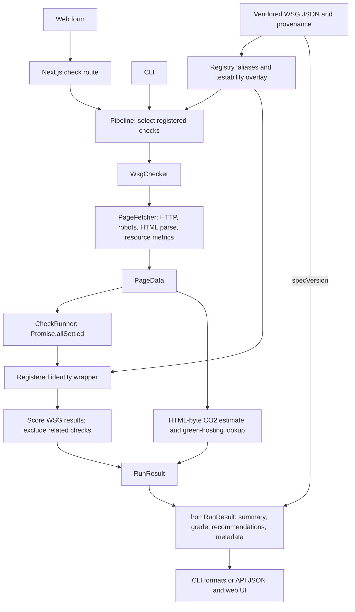

# Architecture

[Documentation index](README.md) · [Decision log](adl.md)

Reviewed against source commit [`fb9ee7e`](https://github.com/ivanoats/wsg-check/commit/fb9ee7e061e1c0681dc5d4d463d1a6048e86ddbd) on 2026-09-24. This describes current source. WSG July-2026 pinning, slug identities, related checks, and report spec provenance are unreleased since v0.1.2.

## Components and boundaries

WSG-Check is a layered TypeScript application shared by a Node.js CLI and a Next.js web application. The original design called this hexagonal/clean architecture; the implementation uses concrete utility imports rather than a complete set of injected ports. `WsgChecker` constructs `PageFetcher`; `PageFetcher` constructs the Axios-backed `HttpClient`. Core types also refer to utility-owned types.

| Component       | Location                               | Responsibility                                                                  |
| --------------- | -------------------------------------- | ------------------------------------------------------------------------------- |
| Web UI and API  | `src/app/`, `src/app/api/`, `src/api/` | Input validation, HTTP responses, presentation, result storage                  |
| CLI             | `src/cli/`                             | Configuration, format/output options, exit codes                                |
| Pipeline        | `src/pipeline/`                        | Check selection with notices, and `runReport` shared by the CLI, API and MCP    |
| MCP server      | `src/mcp/`                             | `wsg-check-mcp` stdio server: `check_url` tool, host policy flags               |
| Core            | `src/core/`                            | Fetch/parse orchestration, parallel check execution, scoring                    |
| Checks          | `src/checks/`                          | Static heuristics, hosting lookup, registered result identities                 |
| Config and spec | `src/config/`, `src/config/spec/`      | Config loading, pinned WSG data, registry and aliases                           |
| Reports         | `src/report/`                          | Summary, grade, recommendations, metadata, four output formats                  |
| Utilities       | `src/utils/`                           | HTTP/robots handling, host policy, HTML parsing, resource metrics, CO₂, logging |

Core code does not import Next.js or the CLI. An ESLint rule keeps Next.js, React, and the Next-based API helpers out of the CLI, pipeline, core, checks, report, config, and utility layers, because the npm package ships without the web app's dependencies. The logger writes to stderr so stdout carries only program output. Checks use core types, configuration, and utilities; most are static functions, but the sustainable-hosting check calls the Green Web Foundation. `WsgChecker` also performs a hosting lookup for its CO₂ estimate. These are external-I/O exceptions, so checks are not universally pure.

## Analysis and reporting flow

`PageFetcher` returns a typed `Result<PageData>` for fetch/parse failures. `CheckRunner` isolates individual check failures with `Promise.allSettled`, retaining registered guideline identity on failures. The wrappers in [check registration](../src/checks/index.ts) apply spec slugs, titles, display numbers, and links; direct raw check exports do not perform that normalization.

The registry is built from the vendored July-2026 snapshot. It serves guideline API requests without fetching a moving upstream spec. Numeric legacy inputs remain compatibility aliases; display numbers are not canonical identities. See [ADR-0005](adr/0005-pin-wsg-spec.md).

## Scoring and report contracts

`pass`, `warn`, and `fail` contribute 100, 50, and 0 points. Impact weights are 3 (high), 2 (medium), and 1 (low). Scores are rounded weighted averages. `info`, `not-applicable`, and `related: true` results do not contribute. A category or run with no scoreable checks defaults to 100; this is not evidence that all guidelines were assessed. All four category scores are returned, including business, which has no automated checks.

`RunResult` carries check results, scores, timing, and CO₂/hosting fields. `fromRunResult` adds the grade, summary, recommendations, methodology, and `SustainabilityReport.specVersion` from `WSG_SPEC.release`. WSG summary counts exclude related checks, which have their own `relatedChecks` count. Recommendations put WSG checks first, then related checks; within each group they sort by impact and failure before warning.

The four unscored related IDs are `security-headers`, `form-validation`, `native-form-features`, and `image-alt-text`. Their failures remain visible without affecting WSG scores. See [ADR-0006](adr/0006-related-checks.md).

## Measurement limits

The runtime fetches HTML and inspects response headers and resource references. It does not execute page JavaScript or measure rendered performance. External asset bytes are not collected. The CO₂ calculation uses `pageWeight.htmlSize` and SWD v4; it is an estimate for HTML bytes, not a full-page energy measurement. Green-hosting lookup failures return `false`, indistinguishable from an unlisted domain in this boolean interface.

`RunResult.pageMetrics` carries the HTML size, resource count, and third-party count from `PageData`, and `fromRunResult` uses them for the report metadata by default. Page weight is the HTML size (from `Content-Length` when present), not the total of all assets.

## Runtime and storage

`POST /api/check` completes the analysis within the request and returns the report; there is no job queue. Next.js routes use the Node.js runtime. API validation and HTTP utilities implement URL/SSRF checks; HTTP fetching also supports robots.txt, caching, retries, and redirect tracking. Without a host policy, `HttpClient` refuses any redirect hop to a private or loopback host. With a `hostPolicy` (see `src/utils/host-policy.ts`), it checks the initial URL before fetching robots.txt and every redirect hop: loopback and private-network targets are allowed only when the policy says so, link-local and metadata addresses are always refused, and a redirect from a non-loopback host into loopback is always refused.

The [result store](../src/api/store.ts) is process-local, with a one-hour TTL and 500-entry cap, enforced lazily on reads/writes. The [rate limiter](../src/api/rate-limit.ts) is also process-local (default 30 requests per 60 seconds per pathname/client key). Forwarded IP headers are trusted only when `WSG_API_TRUST_PROXY=true`. Neither facility coordinates across instances or survives a restart.

After a successful POST, the web form saves the response in `sessionStorage`. The results client reads it first and falls back to `GET /api/check/:id`. This addresses cross-instance serverless 404s for the submitting browser, but does not provide durable or cross-browser report sharing. See [ADR-0004](adr/0004-ephemeral-web-results.md).

`/api/openapi` returns an OpenAPI 3.1 JSON document. It does not host Swagger UI or another interactive explorer.

## Build and release

The web app uses Next.js/React with Panda CSS, Park UI, and Ark UI. `npm run build` builds the web application. `npm run build:cli` uses tsup to produce the Node 22 ESM CLI entry point at `dist/cli/index.js`; it is a separate build. Package runtime requirements and contributor-tool requirements differ: the package declares Node >=22, while current lint-staged requires >=22.22.1 for development.

The npm package and WSG spec have independent versions. Report `specVersion` identifies the targeted ruleset, while package changes and check selection can also affect comparisons. The upstream tag watcher opens issues for review; it does not automatically switch the spec. Release-please and publishing details live in [RELEASING.md](../RELEASING.md); see [ADR-0007](adr/0007-spec-provenance.md) and [ADR-0008](adr/0008-cli-distribution.md).
